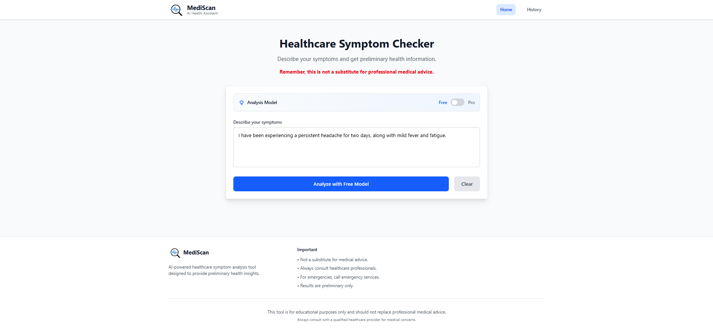

# MediScan - Healthcare Symptom Checker


A full-stack healthcare symptom checker application that uses Google's Gemini AI to analyze symptoms and provide medical insights. Built with React.js frontend and Node.js backend, featuring dual AI models for different analysis depths.

## Features

- **AI-Powered Symptom Analysis**: Leverage Google Gemini AI (2.5 Flash & 2.5 Pro) for intelligent symptom evaluation
- **Dual Model Support**: 
  - Free tier with Gemini 2.5 Flash for basic analysis
  - Pro tier with Gemini 2.5 Pro for detailed medical insights
- **Medical History Tracking**: Store and retrieve previous symptom analyses
- **Responsive Design**: Modern UI built with React and Tailwind CSS
- **Real-time Results**: Instant symptom analysis with loading indicators
- **Data Persistence**: MongoDB integration for storing query history

## Architecture

```
mediscan/
├── backend/           # Node.js Express API server
│   ├── controllers/   # Request handlers
│   ├── models/        # Database schemas
│   ├── routes/        # API route definitions
│   └── services/      # Business logic (Gemini AI, MongoDB)
└── frontend/          # React.js client application
    ├── components/    # Reusable UI components
    ├── pages/         # Application pages
    └── src/           # Main application logic
```

## 🚀 Technology Stack

### Backend
- **Node.js** - Runtime environment
- **Express.js** - Web framework
- **MongoDB** - Database with Mongoose ODM
- **Google Gemini AI** - AI/ML model for symptom analysis
- **CORS** - Cross-origin resource sharing

### Frontend
- **React 19** - UI library
- **Vite** - Build tool and development server
- **Tailwind CSS** - Utility-first CSS framework
- **React Router** - Client-side routing
- **Axios** - HTTP client
- **ESLint** - Code linting

## 🛠️ Installation & Setup

### Prerequisites
- Node.js (v16 or higher)
- MongoDB (local or cloud instance)
- Google Gemini AI API key

### Backend Setup

1. **Navigate to backend directory**
   ```bash
   cd backend
   ```

2. **Install dependencies**
   ```bash
   npm install
   ```

3. **Environment Configuration**
   Create a `.env` file in the backend directory:
   ```env
   PORT={port_number}
   CLIENT_BASE_URL={client_base_url_for_cors_validation}
   MONGODB_URI={your_mongodb_connection_string}
   GEMINI_API_KEY={your_gemini_api_key}
   ```

4. **Start the server**
   ```bash
   # Development mode
   # Uses Nodemon
   npm run dev
   
   # Production mode
   npm start
   ```

### Frontend Setup

1. **Navigate to frontend directory**
   ```bash
   cd frontend
   ```

2. **Install dependencies**
   ```bash
   npm install
   ```

3. **Start the development server**
   ```bash
   npm run dev
   ```

4. **Build for production**
   ```bash
   npm run build
   ```

## 📡 API Endpoints

### Symptom Analysis
- `POST /api/free` - Free tier symptom analysis
- `POST /api/pro` - Pro tier symptom analysis

### History Management
- `GET /api/history` - Retrieve query history
- `DELETE /api/history` - Clear all history

### Request Body Example
```json
{
  "message": "I have been experiencing headache, fever, and fatigue for the past 2 days"
}
```

### Response Format
```json
{
  "conditions": [
    "Common Cold",
    "Viral Upper Respiratory Infection",
    "Flu (Influenza)"
  ],
  "next_steps": "Rest and stay hydrated. Monitor symptoms for 24-48 hours. Consult healthcare provider if symptoms worsen or if fever exceeds 101°F (38.3°C).",
  "disclaimer": "This information is for educational purposes only and is not a substitute for professional medical advice, diagnosis, or treatment. Always consult qualified healthcare providers for medical concerns."
}
```

## Key Components

### Frontend Components

- **SymptomChecker**: Main component for symptom input and analysis
- **ResultDisplay**: Shows AI analysis results and recommendations
- **ModelToggle**: Switch between free and pro AI models
- **LoadingSpinner**: Visual feedback during API calls
- **Alert**: Error and notification display
- **Layout**: Common page structure with header and footer

### Backend Services

- **gemini.service.js**: Google Gemini AI integration
- **mongo.service.js**: MongoDB operations and query management
- **index.controller.js**: Request handling and response formatting

## 🤖 Gemini AI Configuration

The application uses Google's Gemini AI models with carefully tuned parameters for medical symptom analysis:

### Model Parameters
- **Temperature**: `0.3` - Lower temperature for more consistent, focused responses
- **Top-K**: `40` - Limits vocabulary to top 40 most likely tokens
- **Top-P**: `0.85` - Nucleus sampling for balanced creativity and accuracy
- **Max Output Tokens**: `2048` - Sufficient length for detailed medical analysis

### Safety Guidelines
The AI is configured with strict healthcare-specific constraints:

- **No Medical Diagnosis**: AI cannot provide official medical diagnoses
- **No Treatment Prescription**: Cannot recommend specific medications or treatments
- **Educational Focus**: All responses are for informational purposes only
- **Mandatory Disclaimers**: Every response includes medical safety disclaimers
- **Scope Limitation**: Rejects non-medical queries and stays focused on symptom analysis

### Response Structure
All AI responses follow a structured JSON format:

```javascript
{
  conditions: ["Array of probable condition names"],
  next_steps: "String with recommended actions",
  disclaimer: "Mandatory educational safety disclaimer"
}
```

### System Instructions
The AI operates under comprehensive system instructions that ensure:
- Professional and educational tone
- Focus on general, well-known medical conditions
- Cautious and objective analysis
- Avoidance of unnecessary alarm
- Clear boundaries between AI assistance and professional medical care

## Usage



1. **Access the Application**
   - Open your browser to `http://localhost:5173`

2. **Symptom Analysis**
   - Enter your symptoms in the text area
   - Choose between Free (Gemini 2.5 Flash) or Pro (Gemini 2.5 Pro) model
   - Click "Analyze Symptoms" to get AI-powered insights

3. **View History**
   - Navigate to the History page to see previous analyses
   - Clear history when needed

4. **Interpret Results**
   - Review potential conditions with probability indicators
   - Follow recommended next steps
   - Consult healthcare professionals for serious symptoms

## Security Features

- CORS configuration for secure cross-origin requests
- Environment variable protection for sensitive data
- Input validation and sanitization

## Deployment

### Backend Deployment
1. Set up MongoDB Atlas or your preferred MongoDB hosting
2. Deploy to platforms like Heroku, Railway, or DigitalOcean
3. Configure environment variables in your hosting platform
4. Update CORS origins for production URLs

### Frontend Deployment
1. Build the production bundle: `npm run build`
2. Deploy to Vercel, Netlify, or similar static hosting
3. Update API base URLs for production backend

## Contributing

1. Fork the repository
2. Create a feature branch (`git checkout -b feature/amazing-feature`)
3. Commit your changes (`git commit -m 'Add amazing feature'`)
4. Push to the branch (`git push origin feature/amazing-feature`)
5. Open a Pull Request

## Disclaimer

**Important Medical Notice**: This application is for educational and informational purposes only. It should NOT be used as a substitute for professional medical advice, diagnosis, or treatment. Always consult qualified healthcare providers for medical concerns.

---

## 🔧 Development Notes

- The application uses Google Gemini AI models for symptom analysis
- MongoDB stores query history for user reference
- React Router handles client-side navigation
- Tailwind CSS provides responsive design
- Development includes hot reload for both frontend and backend